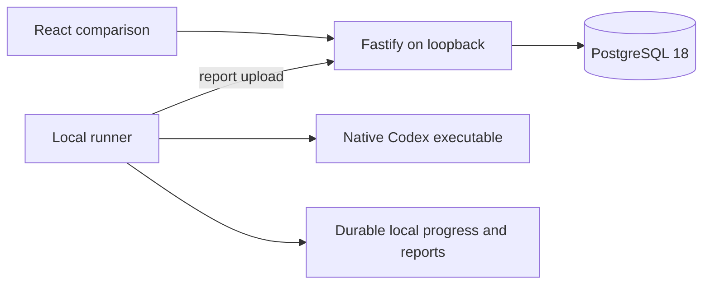

# Architecture

The first implemented loop compares two text answers from Codex. React and Vite build the dashboard. Fastify serves it and the HTTP API. PostgreSQL 18 stores accepted runs and evaluation sessions. The runner is a separate local command that initiates report uploads.

## Implemented ownership

| Path | Responsibility |
| --- | --- |
| `packages/contracts/src/runner.ts` | Immutable task, two entrant outcomes, report and receipt schemas |
| `packages/contracts/src/evaluation.ts` | Explicit blind and revealed browser schemas |
| `apps/server/src/features/runs.ts` | Idempotent report acceptance and public run summaries |
| `apps/server/src/features/evaluation.ts` | Session authority, persisted card mapping, atomic final choice and reveal |
| `apps/server/src/db.ts` | Pool and initial migration |
| `apps/server/src/app.ts` | HTTP validation, runner authorization, cookies, same-origin checks, static files |
| `apps/runner/src/runner.ts` | Codex adapter, immutable run construction, outcome collection and report delivery |
| `apps/runner/src/spool.ts` | Progress schema and flushed atomic JSON writes |
| `apps/runner/src/processes/` | Deadlines, bounded logs, Windows Job Objects and Linux process groups |
| `apps/web/src/` | Run list, blind text cards, choice and reveal |
| `scripts/local.ts` | Per-worktree app and embedded PostgreSQL lifecycle |

Feature queries stay with their owner. The server stores one report aggregate and one session row per evaluation. PostgreSQL uniqueness serializes duplicate reports. A transaction locks a session while saving its final choice. SQL rows never reach the browser. The browser imports only evaluation schemas. `pnpm boundaries` enforces application import restrictions.

## Local execution

`pnpm demo` builds the UI, starts a pinned embedded PostgreSQL 18 binary, starts Fastify on loopback, and runs one fixture comparison. `pnpm local` starts without fixture execution. Database files and runner state live in `.local/`, or `VIBE_LOCAL_ROOT` when configured. Tests allocate their own directories and TCP ports.

Each attempt has a separate workspace and diagnostic directory. The prompt, model IDs, source, run ID, and attempt IDs are saved before launch. A completed report is saved before upload. Started or incomplete attempts are retained as uncertain after interruption and are never relaunched under the same IDs.

Windows launches the native executable suspended, assigns it to a Job Object, and then resumes it. The job kills descendants on timeout, normal parent completion, or supervisor loss. The supervisor also observes runner loss. Linux uses a separate process group and kills the group after completion, timeout, or handled termination. SIGKILL of the Linux runner cannot execute its signal handlers; inspect and stop an orphaned group before retrying after an ungraceful host interruption.

Credentials remain outside workspaces. The runner uses an environment allowlist and removes the server credential from the child boundary. Codex ignores user configuration and repository rules. Text renders with React escaping and no Markdown or HTML execution.

## Scope and design guidance

The local app has a loopback and same-origin boundary. It has no hosted user authentication. Runner bearer authority and browser session authority are separate. Management run and attempt IDs are absent from browser responses; public review IDs and session-scoped card handles are distinct random identifiers.

The [text comparison contract](contracts/text-comparison.md) describes the executable subset. [ADR 0001](decisions/0001-architecture.md) and the broader design contracts remain guidance for later work. Suites, remote scheduling, leases, artifact bundles, S3 storage, richer reporting, React Router, TanStack Query, and Drizzle are not required by this text loop and are not installed. Schema-derived types and explicit SQL implement the current invariants.
