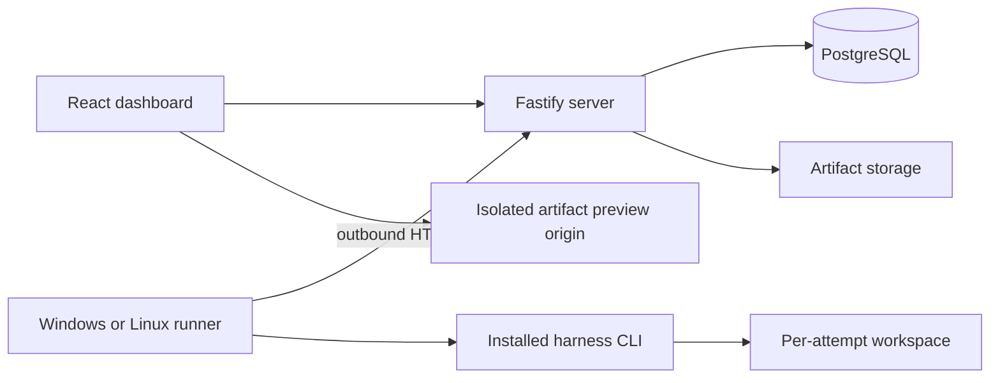

# Architecture

Status: proposed engineering design. Vite + Fastify is the agreed web stack. Application code does not exist yet. [ADR 0001](decisions/0001-architecture.md) explains the main choices.

## Processes and ownership



The Linux server owns accepted state. Runners own execution, local workspaces, and durable report spools. Every runtime connection starts from the runner. The server never invokes a harness or opens a connection into a laptop.

Vite builds the React dashboard. Fastify serves its static assets and the HTTP API in one hosted deployment. The runner remains a separate process on each execution machine.

## Stack

| Area | Technology | Reason |
| --- | --- | --- |
| Language and tooling | Strict TypeScript, Node.js 24, pnpm workspace | Shared language and dependency tooling |
| Dashboard | React, Vite, React Router, TanStack Query, CSS modules | Static assets and explicit client/API boundary |
| HTTP | Fastify and Zod schemas | Request validation and explicit response contracts |
| Persistence | PostgreSQL 18, pg, Drizzle | Transactional state with reviewed migrations |
| Work claims | PostgreSQL transactions and conditional writes | Ownership and accepted outcomes share a transaction boundary |
| Artifacts | Local files for development; S3-compatible hosted storage | Bytes stay outside database rows |
| Tests | Vitest, PostgreSQL integration tests, Playwright, fixture executables | Exercise the actual boundaries |
| CI | GitHub Actions with Windows and Linux runner checks | Verify both required execution platforms |

Pin compatible package versions, the package manager, browser binaries, and container images when introducing them. Use explicit SQL for claims and compare-and-swap operations so transaction conditions remain visible.

## Module map

These are proposed paths. Create directories when they have working code, then keep this map aligned with the implementation.

```text
apps/
  web/src/features/{suites,runs,runtimes,evaluation,reporting}/
  server/src/features/{suites,runs,runtimes,artifacts,evaluation,reporting}/
  server/src/db/
  runner/src/{adapters,tasks,workspaces,processes,spool}/
packages/
  contracts/src/{management,runner,evaluation,artifacts}/
db/migrations/
tests/{acceptance,fixtures}/
```

| Feature | Responsibility |
| --- | --- |
| suites | Definition validation, content versions, revision labels |
| runs | Snapshots, attempts, work claims, accepted outcomes, cancellation |
| runtimes | Runtime identity, readiness, capacity, and authorization |
| artifacts | Upload verification, manifest publication, authorized delivery |
| evaluation | Presentation mappings, session authority, individual judgments |
| reporting | Explicit policy application to saved inputs |
| runner | Workspace preparation, process ownership, adapters, report spooling |

A server feature owns its operations, SQL, and behavior tests. An HTTP handler parses a request and calls the operation that owns its transaction. Use a small public interface for cross-feature calls.

Shared contracts contain wire schemas and protocol examples. Internal domain types remain with their feature. Generate OpenAPI from implemented route schemas rather than maintaining another API specification by hand.

## Import boundaries

- Web imports public HTTP contracts, never server, database, or runner code.
- Blind evaluation UI imports its own contract entry point, not management or runner contracts.
- Server imports contracts and its feature operations, never runner execution modules.
- Runner imports runner/artifact contracts and cannot access the database directly.
- Contracts depend on the schema library, never application modules.
- Shared database utilities handle connections and migrations. Feature queries remain with their owner.

Enforce these rules with restricted-import checks once application modules exist.

## Deployment and isolation

Use PostgreSQL in local development and integration tests. Give each development worktree its own database, ports, and artifact directory. The initial hosting shape is one server instance plus durable database and artifact storage.

Runner authorization and anonymous evaluation access are separate boundaries. A runtime or assignment ID is not a credential. Use loopback or trusted ingress until the deployed authorization boundary exists.

A fresh Git checkout isolates files, not privileges. Untrusted code needs an appropriately isolated account or machine. Active HTML artifacts run on a separate restricted origin.

See the [runner protocol](contracts/runner-protocol.md) for process ownership and the [artifact contract](contracts/artifacts-evaluation.md) for publication and viewer isolation.
