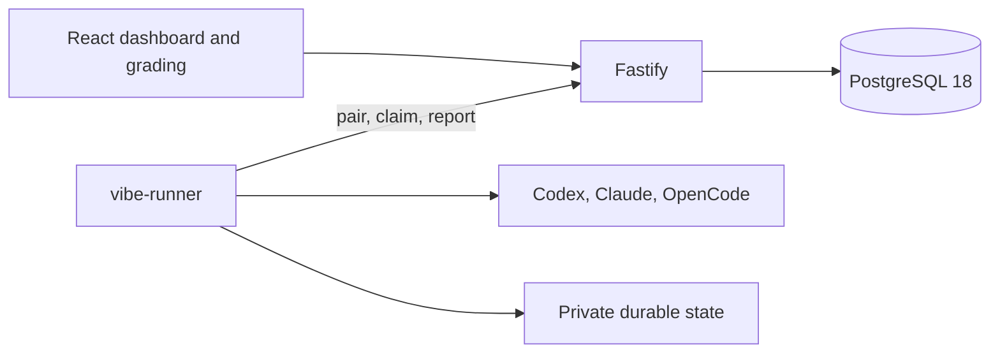

# Architecture

Vibe bench authors immutable suite versions, executes configured matrices, and grades results anonymously. React and Vite build the dashboard. Fastify serves the dashboard and worker APIs. PostgreSQL 18 stores execution snapshots, outcomes, artifacts, and grading sessions. The standalone `vibe-runner` initiates all execution traffic. The dashboard defaults to configured Runs.

The application, PostgreSQL, and runner require Linux. CI uses the self-hosted Linux x64 runner.

## Implemented ownership

| Path | Responsibility |
| --- | --- |
| `packages/contracts/src/suites.ts` | Suite content, draft readiness, ratings, authoring schemas |
| `packages/contracts/src/access.ts` | Pairing enrollment, credentials, private configuration |
| `packages/contracts/src/runtime.ts` | Tool discovery observations and receipts without capacity |
| `packages/contracts/src/configured-runs.ts`, `work.ts`, `task-io.ts` | Immutable run inputs, lifecycle, assignments, outcomes, repository declarations |
| `packages/contracts/src/blind-grading.ts` | Anonymous navigation, result cards, criterion judgments |
| `apps/server/src/features/suites.ts` | Append-only content, exact-base saves, historical reads |
| `apps/server/src/features/access.ts` | Browser sessions, reusable enrollment, revocation, abandonment |
| `apps/server/src/features/runtimes.ts` | Immutable observations, sequence ordering, stable receipts |
| `apps/server/src/features/configured-runs.ts` | Matrix creation, claims, preparation, outcomes, artifacts |
| `apps/server/src/features/blind-grading.ts` | Immutable mappings, cell judgments, scoped authority |
| `apps/server/src/app.ts`, `worker-routes.ts` | HTTP validation, dashboard and runtime authority, cookies, Origin policy |
| `apps/server/src/db.ts` | Pool and ordered transactional migrations |
| `apps/runner/src/cli.ts`, `configuration.ts` | Commander interface, pairing, cached status, private state |
| `apps/runner/src/onboarding.ts` | Shared executable resolution, bounded discovery, acknowledged capabilities |
| `apps/runner/src/execution.ts` | Sequential configured execution and durable report recovery |
| `apps/runner/src/materials.ts`, `adapters.ts`, `artifacts.ts`, `browser-scenario.ts` | Attempt checkout, harness protocols, collection, browser recording |
| `apps/runner/src/spool.ts`, `processes/` | Flushed atomic writes, bounded subprocess lifetime and Linux process groups |
| `apps/web/src/` | Runs, suite editor, runtime pairing, grading, result viewers |
| `scripts/local.ts`, `local-lock.ts` | Per-worktree dashboard lifecycle and state lock |
| `scripts/local-database.ts`, `database-worker.ts` | Database owner lifetime and shutdown |

Feature queries stay with the owner of their invariants. Schemas validate external boundaries and derive application types. Framework objects and SQL rows stay in their modules. Browser code imports explicit management or anonymous schemas. `pnpm boundaries` enforces application ownership.

## Dashboard lifecycle and persistence

`pnpm local` builds assets, starts pinned embedded PostgreSQL 18, and serves Fastify on loopback. It creates no fixture runs or runner connection files. Dashboard data lives under `.local/` or `VIBE_LOCAL_ROOT`. Tests allocate separate directories and ports.

An abstract Unix socket keyed by the canonical state path excludes concurrent dashboard owners. The lock remains until shutdown completes and is released on process death. A dedicated worker owns PostgreSQL, verifies its SQL connection before readiness, and shuts down on owner-pipe closure. Startup and shutdown timeouts terminate its process group. Early shutdown handlers cover interruption during database startup. Saved files remain intact; incomplete first initialization is not automatically repaired.

Suite edits append complete immutable definitions and move the current pointer with an exact base content ID. Configured runs pin saved suite content and entrants before assigning work. The server derives progress from immutable preparation and attempt records, plus durable abandonment records. Migrations remove legacy pairwise tables while preserving the shared immutability function and configured history.

## Pairing and capabilities

`vibe-runner pair TOKEN` replaces existing authority, discovers tools, enrolls, and uploads capabilities. Pairing succeeds only after acknowledgement. A reusable ten-minute token binds one runtime identity. Credential replacement and revocation abandon unfinished assignments, preserve accepted outcomes, and leave completed history intact. Connectivity loss alone preserves assignments.

The runner uses a private standard state directory or global `--state-dir`. It loads no runner `.env` or executable/state/slots overrides. Discovery and execution resolve the same tools on `PATH`. Harness login directories, provider authentication, proxies, certificates, and SSH-agent settings retain normal operating-system behavior. Dashboard credentials and raw authentication output remain outside task workspaces and child environments.

Status reads the last acknowledged capability snapshot and checks authority without discovery. Probe can refresh capabilities during execution without restarting it. Monotonic observation sequences recover the dashboard sequence floor when local state was erased. Older deliveries cannot replace newer observations. Pairing and revocation refuse while execution owns state.

## Configured execution

One runtime claims an entire run and executes attempts sequentially. It saves assignments, preparation, starts, terminal outcomes, and artifacts before transport. Delivery validates receipt identities and replays stable IDs. A started attempt with no durable outcome is uncertain and never executes again under its old ID. Recovery records interruption truthfully.

`run` recovers pending delivery, refreshes capabilities, waits for assignments, and continues across runs. `run-once` waits through an empty queue and exits only after the entire first run is acknowledged. Every attempt owns an independent workspace, diagnostic directory, and browser context. The process module stops Linux descendant groups after completion, timeout, and handled interruption.

The optional worker-only listener shares authority and database lifecycle, rejects browser requests, and exposes no dashboard API. HTTPS termination and remote routing belong to deployment configuration. The [configured-run contract](contracts/configured-runs.md) defines lifecycle and artifact shapes; [access](contracts/access.md) defines pairing and revocation.

## Result viewing

`packages/contracts/src/artifact-viewer.ts` owns strict supplied-URL result presentations and bounded preview inputs. `apps/server/src/features/artifact-viewer.ts` projects primary and declared result files, validates text bytes, and serializes isolated media decoding. Storage reads remain in `configured-runs.ts`. `artifact-viewer-routes.ts` owns management route validation.

`html-preview.ts` owns two bounded interactive sessions and exact manifest asset serving. `isolated-chromium.ts` owns Bubblewrap runtime mounts, network isolation, process deadlines, and teardown. `apps/web/src/result-viewer.tsx` renders the same presentation for any authorized caller. Run management loads a result only when its viewer is expanded. Grading and blind session authority belong to their existing owners.
## Configured-run grading

The grading feature reads immutable configured-run inputs and outcomes. It stores one immutable session mapping and one mutable row per completed card and assigned criterion. Each cell has its own version and transaction lock. Session authority uses its own grading cookie. The browser selects **Grading** without mounting management views or requesting their records.

The [blind-grading contract](contracts/blind-grading.md) defines task-sized reads, pinned criterion snapshots, stable card order, exact retries, and anonymous artifact access. Execution failures and skips remain visible with neutral status. This feature does not reveal identities or calculate aggregate scores.

`grading-viewer-routes.ts` authorizes an existing session/card mapping before calling the shared result projection. Public file URLs use immutable outcome ordinals and neutral labels. The adapter changes no mapping or judgment storage. Both management and grading use the same bounded HTML preview service.

## Installation access

`packages/contracts/src/access.ts` owns enrollment and saved runtime configuration. `features/access.ts` owns dashboard sessions, password generations, login throttling, runtime enrollment, and revocation. `worker-routes.ts` applies the same runtime authority on both listeners. `apps/web/src/access.tsx` gates the dashboard, and `runtimes.tsx` owns enrollment and credential management. See the [access contract](contracts/access.md).
