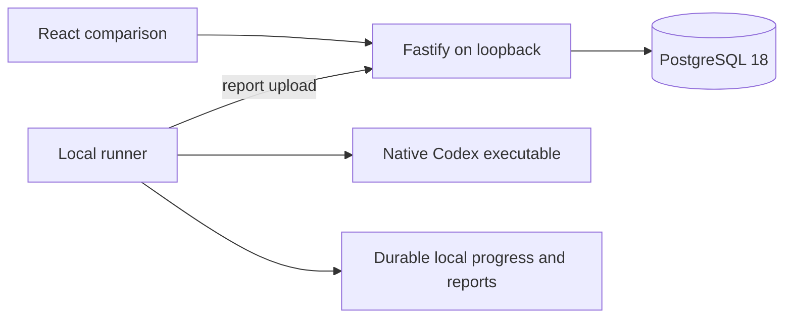

# Architecture

The app authors versioned suites and compares two text answers from Codex. React and Vite build the dashboard. Fastify serves it and the HTTP API. PostgreSQL 18 stores accepted runs and evaluation sessions. The runner is a separate local command that initiates report uploads.

The application, PostgreSQL, and execution runtime support Linux only. CI uses the self-hosted Linux x64 runner.

## Implemented ownership

| Path | Responsibility |
| --- | --- |
| `packages/contracts/src/runner.ts` | Immutable task, two entrant outcomes, report and receipt schemas |
| `packages/contracts/src/suites.ts` | Suite aggregates, draft readiness, rating conversion and authoring DTOs |
| `apps/server/src/features/suites.ts` | Append-only suite content, exact-version saves and historical reads |
| `packages/contracts/src/evaluation.ts` | Explicit blind and revealed browser schemas |
| `apps/server/src/features/runs.ts` | Idempotent report acceptance and public run summaries |
| `apps/server/src/features/evaluation.ts` | Session authority, persisted card mapping, atomic final choice and reveal |
| `apps/server/src/db.ts` | Pool and transactionally ordered migrations |
| `apps/server/src/app.ts` | HTTP validation, runner authorization, cookies, same-origin checks, static files |
| `apps/runner/src/runner.ts` | Codex adapter, immutable run construction, outcome collection and report delivery |
| `apps/runner/src/spool.ts` | Progress schema and flushed atomic JSON writes |
| `apps/runner/src/processes/` | Deadlines, bounded logs and Linux process groups |
| `apps/web/src/` | Suite editor and history, run list, blind text cards, choice and reveal |
| `scripts/local.ts`, `scripts/local-lock.ts` | Per-worktree app lifecycle and kernel-owned state-directory lock |
| `scripts/local-database.ts`, `scripts/database-worker.ts` | Database owner lifetime and graceful shutdown |

Feature queries stay with their owner. The server stores one report aggregate and one session row per evaluation. PostgreSQL uniqueness serializes duplicate reports. A transaction locks a session while saving its final choice. SQL rows never reach the browser. The browser imports only evaluation and suite authoring schemas. `pnpm boundaries` enforces application import restrictions.

## Local execution

`pnpm demo` builds the UI, starts a pinned embedded PostgreSQL 18 binary, starts Fastify on loopback, and runs one fixture comparison. `pnpm local` starts without fixture execution. Database files and runner state live in `.local/`, or `VIBE_LOCAL_ROOT` when configured. Tests allocate their own directories and TCP ports.

An abstract Unix socket keyed by the canonical state-directory path excludes concurrent local app owners. The kernel releases the lock on process death. The app holds the lock until shutdown finishes.

A dedicated worker owns PostgreSQL from initialization through shutdown. Owner-pipe closure asks the worker to stop PostgreSQL. Startup and shutdown timeouts terminate the owned process group. The app registers shutdown handlers before database startup completes. Saved database files are preserved. Interruption during the first `initdb` can leave an incomplete directory; startup does not delete that directory or claim to repair it automatically.

Suite edits append immutable whole definitions and move a current pointer. Every edit requires an explicit minor or new-revision choice and an exact base content ID. The [suite contract](contracts/suites.md) defines readiness, rating conversions and pinned input export.

Each attempt has a separate workspace and diagnostic directory. The prompt, model IDs, source, run ID, and attempt IDs are saved before launch. A completed report is saved before upload. Started or incomplete attempts are retained as uncertain after interruption and are never relaunched under the same IDs.

The runner uses a separate Linux process group and kills the group after completion, timeout, or handled termination. SIGKILL cannot execute its signal handlers; inspect and stop an orphaned group before retrying after an ungraceful host interruption.

Credentials remain outside workspaces. The runner uses an environment allowlist and removes the server credential from the child boundary. Codex ignores user configuration and repository rules. Text renders with React escaping and no Markdown or HTML execution.

## Scope and design guidance

The local app has a loopback and same-origin boundary. It has no hosted user authentication. Runner bearer authority and browser session authority are separate. Management run and attempt IDs are absent from browser responses; public review IDs and session-scoped card handles are distinct random identifiers.

The [text comparison contract](contracts/text-comparison.md) describes the executable subset. [ADR 0001](decisions/0001-architecture.md) and the broader design contracts remain guidance for later work. Remote scheduling, leases, artifact bundles, S3 storage, richer reporting, React Router, TanStack Query, and Drizzle are not required by this text loop and are not installed. Schema-derived types and explicit SQL implement the current invariants.

## Runtime registration

`packages/contracts/src/runtime.ts` owns protocol-1 runtime observations and receipts. `apps/runner/src/onboarding.ts` owns bounded tool discovery, separate harness readiness, a durable runtime identity and observation sequence, and outbound delivery. `apps/server/src/features/runtimes.ts` owns immutable observations and stable duplicate receipts. Latest runtime inspection selects the greatest observation sequence rather than trusting machine clocks or arrival order.

The existing text runner remains separate. Runtime onboarding initiates all network traffic and opens no worker-side listener. An optional worker-only Fastify listener in `apps/server/src/worker-app.ts` shares the local database lifecycle. Its only endpoint accepts registrations, with browser requests rejected. HTTPS termination belongs to a trusted remote proxy. Registration authentication is deferred to KV-49. Corpus acquisition is deferred to KV-48. Scheduling and job execution are not implemented by registration.
